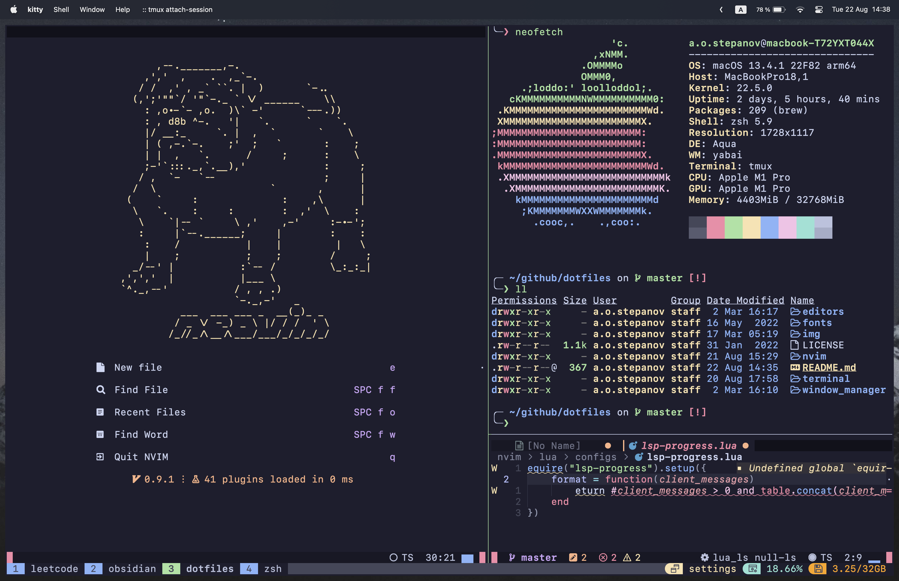

<h1 align="center">
    <code>.dotfiles</code>
</h1>

### Now using

* Operating system - `MacOS Monterey`
* Font - `Cascadia Code`
* Terminal emulator - `kitty`
* Terminal multiplexer - `tmux`
* Shell - `zsh` + `oh my zsh`
* Text editor - `NeoVim`
* NeoVim plugin manager - `packer`
