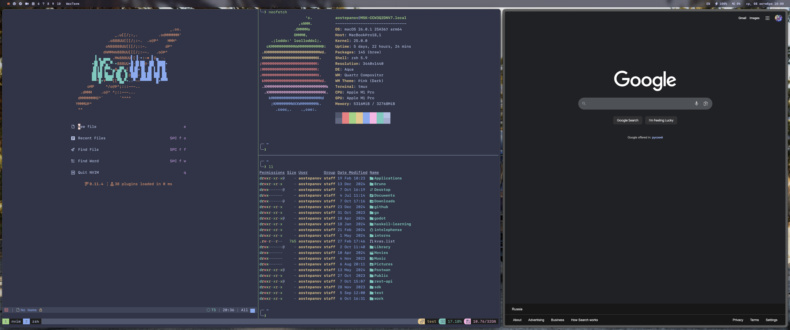

<h1 align="center">
    <code>.dotfiles</code>
</h1>

### Now using

- Operating system - [`MacOS Tahoe`](https://www.apple.com/os/macos/)
- Spotlight replacement - [`Raycast`](https://www.raycast.com/)
- Window manager - [`yabai`](https://github.com/asmvik/yabai) + [`skhd`](https://github.com/asmvik/skhd)
- Font - [`SF Mono`](./fonts/README.md) + [`nonicons`](https://github.com/ya2s/nonicons)
- Terminal emulator - [`WezTerm`](https://wezfurlong.org/wezterm/)
- Terminal multiplexer - [`tmux`](https://github.com/tmux/tmux)
- Shell - [`zsh`](https://www.zsh.org) + [`starship`](https://starship.rs)
- Text editor - [`NeoVim`](https://neovim.io)
- NeoVim plugin manager - [`lazy`](https://github.com/folke/lazy.nvim)
